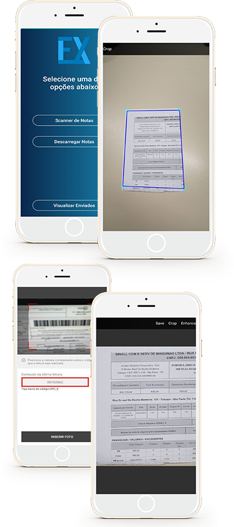

# ExportExpress
Aplicativo de demonstração para transportadoras.
 
- [x] Reconhecimento de Folhas por I.A
- [x] Leitor de Barcode
- [x] Aprimoramento de imagem
- [x] Geolocalização do momento da foto
- [x] Lista de arquivos em fila para upload
- [x] Lista de arquivos enviados para conferencia no App
- [x] Site para monitoramento
 

## Links
Aplicação: https://play.google.com/store/apps/details?id=maikson.ExportXpressDEMO  
Acesso a pagina Admin : http://azure.infordoc.com/maikson/Bootstrap/EntregasXpress/login.html  

## Linguagens e Ferramentas
Retrofit2  
PHP  
MSSQL  
Android Studio  
Kotlin  
OpenCV  
Bootstrap 4  

